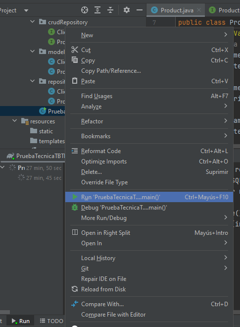
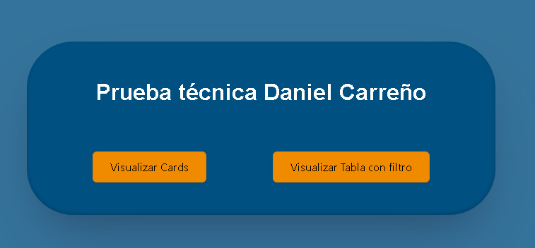
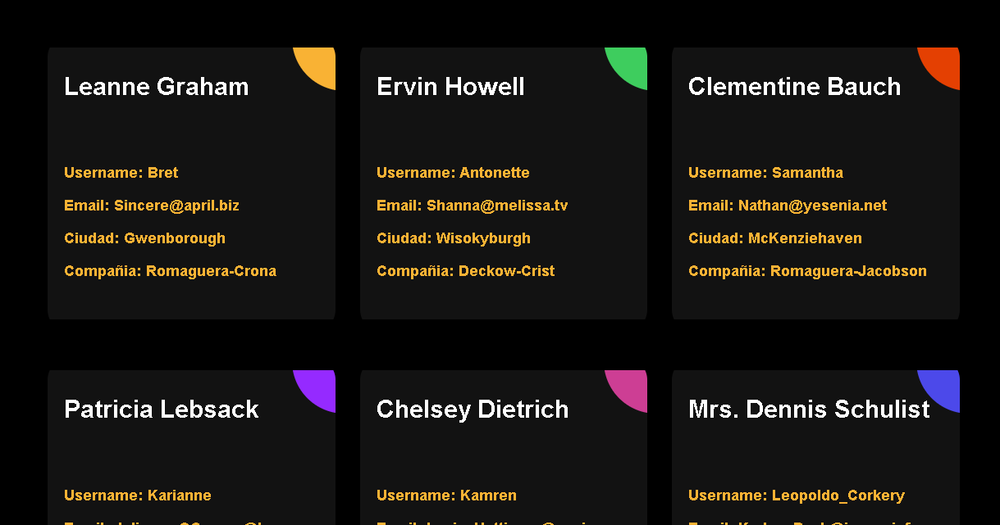
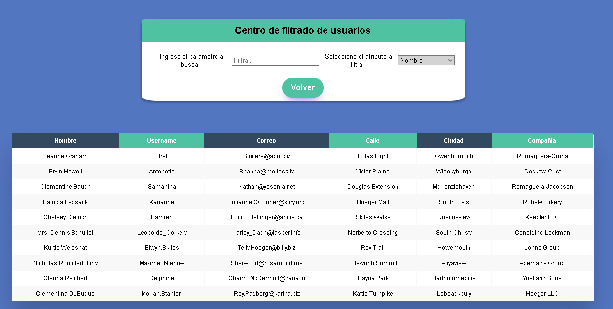

# Prueba técnica TBTB Daniel Carreño
## Primera Parte: Base de datos 
La carpeta "scripts" que se encuentra en el repositorio contiene los archivos .sql correspondientes a esta parte.
La base de datos trabajada fue creada con el motor **PostgreSQL**.
Dentro de la carpeta "scripts" se incluye un archivo llamado **"Prueba técnica TBTB Parte 1.PDF"** en donde se encuentras los modelos entidad-relación y relacional junto con los tipos de dato de la base de datos creada.
Los pasos para poner en funcionamiento la base de datos son:
1. Crear dentro del motor de PostgreSQL una base de datos con el nombre: **"danielcarrenopruebatecnica"**.
2. Una vez creada la base de datos, ejecutar el script llamado **"Creacion.sql"** el cuál se encargará de generar las tablas clients ,orders, product y order_product.
3. Ya creadas las tablas, se procede a utilizar el script **"Transacciones.sql"**, el cual contiene las operaciones requeridas sobre la base de datos, **PRIMERO** ejecutar las líneas correspondientes a la inserción de registros, las cuales se encuentran al inicio del script.
4. Una vez se ejecutan las inserciones es posible hacer uso de las operaciones SELECT presentes en el archivo **"Transacciones.sql"**.
5. Ejecutar operaciones de UPDATE para algunas entidades de order.
6. Finalmente utilizar la operación DELETE que se encuentra al final del archivo.

## Segunda Parte: Interfaz de programación de Aplicación (API)
La API fue desarrollada en el lenguaje de programación **Java** utilizando el framework **Spring boot** y se necesita del IDE **IntelliJ IDEA**, los pasos para la instalacion y puesta en funcionamiento del proyecto son los siguientes:
1. Clonar el repositorio del proyecto, este contiene todos los archivos de la segunda y tercera parte.
2. Una vez clonado, dentro de esta carpeta se encuentra el archivo **"build.gradle"** (la dirección del archivo es la siguiente **\PruebaTecnicaTBTB\build.gradle**) hacer clic derecho en el archivo  y seleccionar la opción: **"Edit with IntelliJ IDEA**, esto abrira el IDE junto con el proyecto e instalará las dependencias necesarias.
3. Ya abierto el proyecto e instaladas las dependencias, se procede a configurar el archivo **"application.properties"** (la dirección del archivo es la siguiente **\PruebaTecnicaTBTB\application.properties**), dentro de este reemplazar el valor de **"spring.datasource.username"** por el usuario creado al instalar PostgreSQL en su dispositivo y el de **"spring.datasource.password"** por la contraseña correspondiente al usuario creado al instalar PostgreSQL en su dispositivo. **NOTA:** se decidió utilizar el puerto 8090 de localhost para evitar inconvenientes con el puerto 8080 que se suele utilizar.
4. Una vez se tiene configurado el archivo anterior ejecutar la clase **"PruebaTecnicaTBTBApplication"**, esto se logra haciendo clic derecho encima de la clase mencionada dentro de la lista que aparece a la izquierda dentro del IDE, la cual pondrá en funcionamiento el proyecto.

5. Se crearon los CRUD para dos tablas de la base de datos: **clients y product** , las direcciones para acceder a los endpoints utilizando **Postman** son las siguientes:

**Tabla clients**
1. Crear un nuevo registro:
			curl --location 'http://localhost:8090/client/save' \
			--header 'Content-Type: application/json' \
			--data  '{
			"id":1233699877,
			"clientName":"Daniel",
			"lastName": "Carreño",
			"address": "calle 50 #1-28"
			}'
2. Get All:  curl --location 'http://localhost:8090/client/all'
3. Get by id: curl --location 'http://localhost:8090/client/1951736268'
4. Update:
		curl --location --request PUT 'http://localhost:8090/client/update' \
		--header 'Content-Type: application/json' \
		--data  '{
		"id":1233699877,
		"clientName":"David",
		"lastName": "Carreño",
		"address": "calle 13 #1-28"
		}'
5. Delete: curl --location --request DELETE 'http://localhost:8090/client/delete/1233699877'

**Tabla product**
1. Crear un nuevo registro:
		curl --location 'http://localhost:8090/product/save' \
		--header 'Content-Type: application/json' \
		--data  '{
		"productName":"Papas de pollo",
		"price": 6000,
		"stock": 30
		}'
2. Get All: curl --location 'http://localhost:8090/product/all'
3. Get by id: curl --location 'http://localhost:8090/product/4'
4. Update:
		curl --location --request PUT 'http://localhost:8090/product/update' \
		--header 'Content-Type: application/json' \
		--data '{
		    "id":7,
		    "productName":"Galletas de chocolate",
		    "price": 3000,
		    "stock": 50
		}'
5. Delete: curl --location --request DELETE 'http://localhost:8090/product/delete/7'

## Tercera Parte: Aplicación Web
Para la tercera parte, se realizaron dos vistas que despliegan la información proporcionada según lo requerido. Esta aplicación Web fue desarrollada utilizando el framework **React**. El proyecto se encuentra en la carpeta **"prueba-tecnica-parte3"** la cual esta ubicada dentro del repositorio anteriormente clonado. Los pasos para la instalación y puesta en funcionamiento del proyecto son los siguientes:
1. Abrir la carpeta **"prueba-tecnica-parte3"** con **Visual Studio Code**.
2. Una vez abierta la carpeta, abrir un nuevo terminal dentro de Visual Studio y ejecutar el comando: **"npm install"**, el cual instalara las dependencias necesarias.
3. Ya instaladas las dependencias ejecutar nuevamente dentro del terminal el comando **"npm start"** el cual pondra en funcionamiento el proyecto y se desplegará en el navegador.
4. Aquí se encontrada una vista Home que presentará botones para cada una de las vistas creadas, una desplegando la información de los usuarios en Cards y la otra utilizando una tabla donde es posible filtrar a los usuarios por nombre,correo o ciudad.

Para filtrar se selecciona el atributo por el cual se desea buscar en la lista desplegable de la derecha y luego se ingresa el texto en el campo de texto de la derecha.

